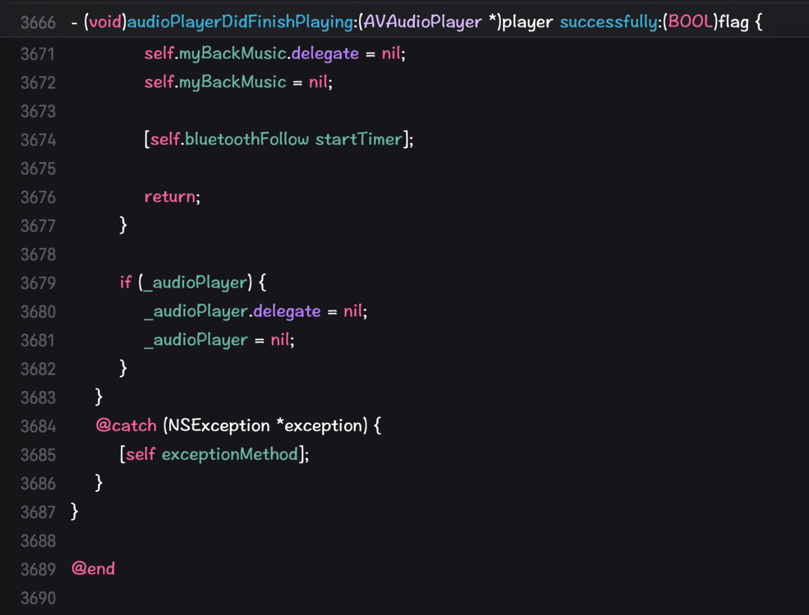
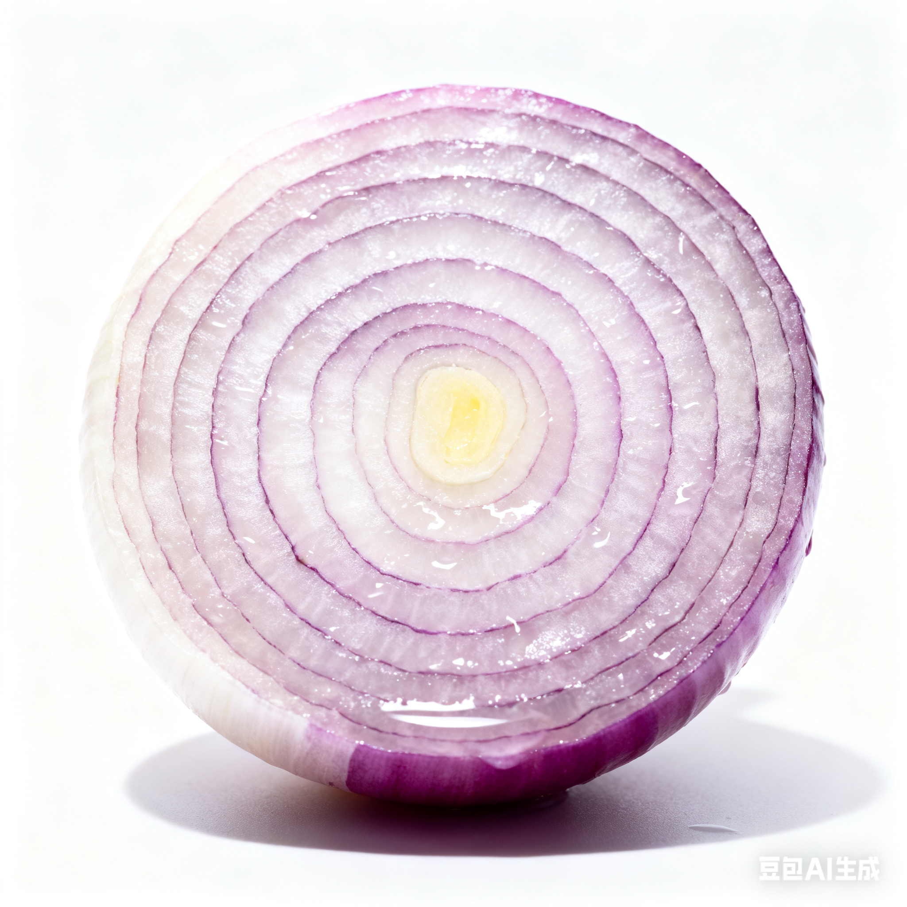
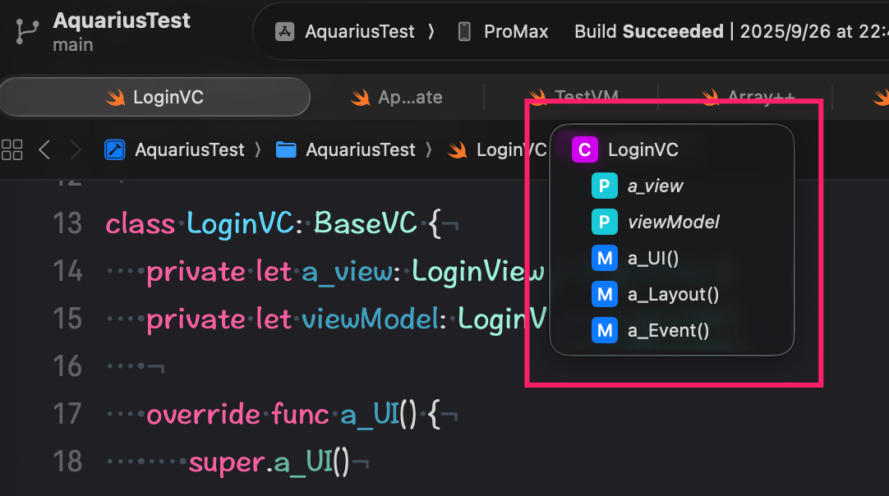

大家好，我是K哥。一名独立开发者，同时也是Swift开发框架【**Aquarius**】的作者，**悦记**和**爱寻车**app的开发者。

**Aquarius**开发框架旨在帮助独立开发者和中小型团队，完成iOS App的快速实现与迭代。使用框架开发将给你带来简单、高效、易维护的编程体验。

---

# 你的代码是这样的吗？

无论你是用Objective-C还是用Swift编写你的代码，想一想是不是**viewController**中拥有大量的代码，动辄就几千行



试想一下，如果想在这几千行代码里进行维护你应该怎么办呢？

是不是非常痛苦，痛苦的还不只是这几千行的代码。痛苦的地方在于，来了新的需求，你要把各个关联代码写在不同的方法中，几十上百个方法，再加上没有注释，怎么样？是不是头发开始哇哇的掉。

这些K哥也和大家一样，经历过、体会过、痛苦过。

所以，K哥萌生要设计一款开发框架时，第一个考虑的就是如何解决在成千上万行代码中能够快速定位的问题，如何让你的代码能够顺利的过渡给其他小伙伴。

尤其在中小型团队中，大家编程的经验都各不相同，如何让团队的小伙伴顺利接手其他人的代码，是实现快速开发、快速迭代、后期易维护的最关键要素。

如何解决这些问题呢？

基于以上问题，于是洋葱开发法诞生了。

# 洋葱开发法

## 何为洋葱开发法

大家不妨看一下下面这张图片里洋葱的样子



洋葱具备了明显的分层结构，各层最终组合到一起形成一个完整的洋葱。

再想一想我们平时写的代码。

大家试想一下，**viewController**中的**viewWillAppear**和**presentViewController**这两个方法有什么区别？

思考中……

K哥认为**viewWillAppear**属于职责型方法，它是在某些特定条件下执行的，而**presentViewController**是功能性方法，它只负责完成某项功能的实现。

如果我们在开发过程中，加入具备类似**viewWillAppear**或**viewDidLoad**这种职责型的方法，让负责不同职责的代码放在它对应的职责型方法中，是不是**swift**文件变得非常易读啦。

非常好。

下面我们再分析一下，我们平时在**viewController**中都完成了哪些功能呢？K哥来总结一下，如有遗漏，大家评论区补充哈。

1. 自定义导航条

2. 初始化界面中的各个UI控件

3. 调整各个UI控件的参数

4. 将这些UI控件放到view中

5. 处理某些UI控件的Delegate，比如**UITableView、UITextField**等

6. 处理某些通知

……

大致这些吧，当然根据不同人的喜好，可能还有负责其他功能的代码。

有的同学可能做的比较好，会把处理UI控件的都放到**view**中，负责**逻辑处理**的放到单独的文件中。

大体情况就是这些。

如果我们把这些职责进行分层。就像前面说的，把设置UI的部分都统一放在一起，把设置Delegate的都放在一起。

我们的代码是不是就具有了明显的分层结构啦。

这些分层结构组合在一起，是不是就是你原来写的乱七八糟的**viewController**了。

再看一下上面洋葱的图片，把各个分层组合在一起，是不是就类似一个完整的洋葱了。

这就是洋葱开发法的核心思想。

## 洋葱开发法的优点

下面我们看一下**洋葱开发法**的优点。

首先，给大家看一下使用**洋葱开发法**开发的代码长什么样。

```swift
import UIKit
import Foundation

import Aquarius
import CommonFramework

class LoginVC: BaseVC {
    private let a_view: LoginView = LoginView()
    private let viewModel: LoginVM = LoginVM()

    override func a_UI() {
        super.a_UI()

        addRootView(view: a_view)
    }

    override func a_Layout() {
        super.a_Layout()

        a_view.equalScreenSize()
        a_view.equalZeroTopAndLeft()
    }

    override func a_Event() {
        super.a_Event()
        /*
        a_view.loginButton.addTouchUpInsideBlock { [weak self] control in
            self?.viewModel.login(email: self!.a_view.userTextField.text!)
            self?.dismiss(animated: true)
        }
         */
    }
}
```

整体的**Swift**文件具备明显的分层结构将添加UI控件的所有代码都放到了**a_UI**中，将UI控件的布局方法都放到了**a_Layout**中，将所有的事件都放到了**a_Event**中。

那么使用**洋葱开发法**后，明显的变化是什么呢？

如果团队内的小伙伴都使用**洋葱开发法**开发的话，我们在看其他人代码的时候就会很清楚，处理事件的代码在哪里，处理通知的方法在哪里，处理UI控件布局的方法在哪里。你就能快速的知道出问题的地方在哪里。

再看下面的截图



这里显示了整个类中都有哪些方法。

如果是基于**洋葱开发法**的话，是不是我们就可以马上知道这个类中没有通知的处理，没有处理Delegate。

怎么样，是不是一目了然。

整理一下，使用**洋葱开发法**的优点如下：

1. 降低了组内多人协作开发的难度

2. 提高了代码易读性

3. 代码更优雅

4. 后期维护难度大大降低

5. 团队人员更迭时，更易于顺利交接

6. 降低代码出错率

7. 提高代码评审速度

8. 提高了团队整体开发能力

## Aquarius开发框架中的实现方案

**Aquarius**开发框架针对**洋葱开发法**提供了大量的分层方法。包括：

1. a_Preview：开始前执行

2. a_Begin：开始执行时调用

3. a_Navigaiton：定制化导航条

4. a_UI：设置UI组件

5. a_UIConfig：设置UI组件参数

6. a_Layout：设置UI组件的布局

7. a_Delegate：设置delegate

8. updateThemeStyle：深色模式切换时调用

9. a_Notification：设置通知

10. a_Bind：设置数据绑定

11. a_Observe：设置Observe

12. a_Event：设置事件

13. a_Other：设置其它内容

14. a_End：代码末尾执行

15. a_Test：测试的代码函数，此函数只在debug模式下执行，发布后不执行

16. a_Clear：销毁时执行

## 哪些类支持洋葱开发法呢

那么**Aquarius**开发框架中哪些类支持洋葱开发法中的分层方法呢？

1. AViewController：所有**Controller**的基类

2. AView：所有**View**的基类

3. AViewModel：所有**ViewModel**的基类

4. ATableViewCell：所有**TableViewCell**的基类

5. ACollectionViewCell：所有**CollectionViewCell**的基类

6. ANavigationController：所有**NavigationController**的基类

7. ATableBarController：所有**TabBarController**的基类

8. ATableViewHeaderFooterView：所有**TableViewHeaderFooterView**的基类

## 基于Aquarius开发框架如何使用呢

当你将**Aquarius**开发框架导入你的工程后，当你创建上面介绍的UI控件时，请分别继承**Aquarius**开发框架的基类，请放心使用它们。

举个例子：

当你创建一个**UIView**的**Swift**文件时，你可以继承**Aquarius**中的**AView**

举个例子吧。

```swift
import UIKit
import Foundation

import Aquarius

class LoginView: AView {
    private let backButton: UIButton = A.ui.button
    public let titleLabel: UILabel = A.ui.label

    public let userTextField: UITextField = A.ui.textField
    private let userLeftView: UIView = A.ui.view
    private let userLeftImageView: UIImageView = A.ui.imageView

    private let passTextField: UITextField = A.ui.textField
    private let passLeftView: UIView = A.ui.view
    private let passLeftImageView: UIImageView = A.ui.imageView

    private let forgotPassButton: UIButton = A.ui.button
    public let loginButton: UIButton = A.ui.button

    private let signInWithLineView: UIView = A.ui.view
    private let signInWithLabel: UILabel = A.ui.label

    private let twitterButton: UIButton = A.ui.button
    private let facebookButton: UIButton = A.ui.button
    private let googleButton: UIButton = A.ui.button

    private let dontAccountLabel: UILabel = A.ui.label
    private let signUpButton: UIButton = A.ui.button

    private let bindID: String = "bindID"

    override func a_UI() {
        super.a_UI()

        addSubviews(views: [
            backButton,
            titleLabel,

            userTextField,
            passTextField,
            forgotPassButton,
            loginButton,

            signInWithLineView,
            signInWithLabel,
            twitterButton,
            facebookButton,
            googleButton,

            dontAccountLabel,
            signUpButton
        ])

        userLeftView.addSubview(userLeftImageView)
        userTextField.leftView = userLeftView

        passLeftView.addSubview(passLeftImageView)
        passTextField.leftView = passLeftView
    }

    override func a_UIConfig() {
        super.a_UIConfig()

        backButton.setImage("back.png".toNamedImage(), for: .normal)
        titleLabel.textLeftAlignment()
        titleLabel.font(28.0.toBoldFont)
        titleLabel.text = "Welcome back"

        userTextField.styleDesign(textFieldStyle)
        userTextField.placeholder = "Enter your Email"
        userLeftImageView.image = "email-icon.png".toNamedImage()

        passTextField.styleDesign(textFieldStyle)
        passTextField.placeholder = "Enter your password"
        passLeftImageView.image = "Pat.png".toNamedImage()

        forgotPassButton.setTitle("Forgot password?", for: .normal)
        forgotPassButton.titleLabel?.font = 17.toFont

        loginButton.layerCornerRadius(12.0)
        loginButton.setTitle("Login", for: .normal)
        loginButton.titleLabel?.font = 20.toBoldFont
        loginButton.liquid_ProminentClearGlass()

        signInWithLabel.font = 17.0.toFont
        signInWithLabel.textCenterAlignment()
        signInWithLabel.text = "  Sign In With  "

        facebookButton.setImage("facebook.png".toNamedImage(), for: .normal)
        facebookButton.layerCornerRadius(20.0)
        facebookButton.layerBorderWidth(1.0)

        //twitterButton.setImage("twetter.png".toNamedImage(), for: .normal)
        twitterButton.layerCornerRadius(20.0)
        //twitterButton.layerBorderWidth(1.0)

        twitterButton.liquid_ProminentClearGlass(image: "twetter.png".toNamedImage())

        googleButton.setImage("Google.png".toNamedImage(), for: .normal)
        googleButton.layerCornerRadius(20.0)
        googleButton.layerBorderWidth(1.0)

        dontAccountLabel.text = "Don't have an account?"
        dontAccountLabel.textRightAlignment()
        dontAccountLabel.font(17.0.toFont)

        signUpButton.setTitle("SIGN UP", for: .normal)
        signUpButton.titleLabel?.font(17.0.toFont)
    }

    override func a_Layout() {
        super.a_Layout()

        backButton.size(sizes: [20, 17])
        backButton.left(left: 26.0)
        backButton.top(top: statusBarHeight()+10.0)

        titleLabel.equalTextSize()
        titleLabel.left(left: 37.0)
        titleLabel.alignTop(view: backButton, offset: 58.0)

        userTextField.equalScreenWidth(37.0*2)
        userTextField.height(height: 46.0)
        userTextField.left(left: 37.0)
        userTextField.alignTop(view: titleLabel, offset: 49.0)

        userLeftImageView.size(sizes: [16, 12])
        userLeftImageView.left(left: 15.0)
        userLeftImageView.top(top: (49-12)/2)

        userLeftView.width(width: 16+15*2)
        userLeftView.equalHeight(target: userTextField)
        userLeftView.equalZeroTopAndLeft()

        passTextField.equalSize(target: userTextField)
        passTextField.equalLeft(target: userTextField)
        passTextField.alignTop(view: userTextField, offset: 20.0)

        passLeftImageView.size(sizes: [16, 19])
        passLeftImageView.left(left: 15.0)
        passLeftImageView.top(top: (49-19)/2)

        passLeftView.equalSize(target: userLeftView)
        passLeftView.equalZeroTopAndLeft()

        forgotPassButton.size(size: forgotPassButton.titleLabel!.getTextSize())
        forgotPassButton.equalRight(target: userTextField)
        forgotPassButton.alignTop(view: passTextField, offset: 13.0)

        loginButton.equalSize(target: userTextField)
        loginButton.equalLeft(target: userTextField)
        loginButton.alignTop(view: forgotPassButton, offset: 49.0)

        signInWithLineView.equalScreenWidth(107.5*2)
        signInWithLineView.height(height: 1.0)
        signInWithLineView.left(left: 107.5)
        signInWithLineView.alignTop(view: loginButton, offset: 76.5)

        signInWithLabel.equalTextSize()
        signInWithLabel.left(left: (screenWidth()-signInWithLabel.width())/2)
        signInWithLabel.equalTop(target: signInWithLineView, offset: -signInWithLabel.height()/2)

        facebookButton.size(widthHeight: 40.0)
        facebookButton.left(left: (screenWidth()-facebookButton.width())/2)
        facebookButton.alignTop(view: signInWithLabel, offset: 28.0)

        twitterButton.equalSize(target: facebookButton)
        twitterButton.equalTop(target: facebookButton)
        twitterButton.equalLeft(target: facebookButton, offset: -(45.0+twitterButton.width()))

        googleButton.equalSize(target: facebookButton)
        googleButton.equalTop(target: facebookButton)
        googleButton.alignLeft(view: facebookButton, offset: 45.0)

        dontAccountLabel.equalTextSize()
        dontAccountLabel.left(left: 10.0)
        dontAccountLabel.equalBottom(target: self, offset: tabBarHeight()+safeAreaFooterHeight()+30.0)

        signUpButton.size(size: signUpButton.titleLabel!.getTextSize())
        signUpButton.equalTop(target: dontAccountLabel)

        dontAccountLabel.left(left: (screenWidth()-dontAccountLabel.width()-signUpButton.width()-8)/2)
        signUpButton.alignLeft(view: dontAccountLabel, offset: 8.0)
    }

    override func a_Bind() {
        super.a_Bind()

        let key: String = bindText(ui: userTextField)
        bindText(bindKey: key, ui: passTextField)
    }

    override func updateThemeStyle() {
        super.updateThemeStyle()

        titleLabel.textColor = 0x00B5BA.toColor
        userTextField.textColor = 0x3E3E3E.toColor
        userTextField.placeHolderColor = 0xB2BDC4.toColor
        userTextField.backgroundColor = 0xF6F6F6.toColor

        passTextField.textColor = 0x3E3E3E.toColor
        passTextField.placeHolderColor = 0xB2BDC4.toColor
        passTextField.backgroundColor = 0xF6F6F6.toColor

        forgotPassButton.setTitleColor(0x3E3E3E.toColor, for: .normal)
        loginButton.backgroundColor = 0x00B5BA.toColor
        loginButton.setTitleColor(.white, for: .normal)

        signInWithLineView.backgroundColor = 0xD2D2D2.toColor
        signInWithLabel.textColor = 0x7B7B7B.toColor
        signInWithLabel.whiteBackgroundColor()

        facebookButton.layerBorderColor(0xD2D2D2.toColor)
        twitterButton.layerBorderColor(0xD2D2D2.toColor)
        googleButton.layerBorderColor(0xD2D2D2.toColor)

        dontAccountLabel.textColor = 0x3E3E3E.toColor
        signUpButton.setTitleColor(0x00B5BA.toColor, for: .normal)
    }

    override func a_Event() {
        super.a_Event()

        loginButton.addTouchUpInsideBlock { [weak self] control in
            self?.passTextField.equalSize(target: self!.userTextField)
            self?.passTextField.equalLeft(target: self!.userTextField)
            self?.passTextField.alignTop(view: self!.userTextField, offset: 8.0)
        }
    }

    override func a_Test() {
        super.a_Test()

        //[backButton, titleLabel].debugMode()

        let testView: UIView = A.ui.view
        testView.size(widthHeight: 50.0)
        testView.equalLeft(target: twitterButton)
        testView.alignTop(view: twitterButton, offset: 16.0)
        testView.redBackgroundColor()
        if #available(iOS 26.0, *) {
            testView.cornerConfiguration = .corners(topLeftRadius: 10, topRightRadius: 20, bottomLeftRadius: 30, bottomRightRadius: 40)
        }
        addSubView(testView)
    }
}
```

是不是觉得上面的代码中，有很多代码你都不认得，这还是**Swift**吗？

请不要在意它们，在接下来的文章中，我都会详细介绍。

你只需要关心这个UIView中，**洋葱开发法**是如何实现的即可。

看完以上代码有何感觉？

是不是代码变得特别清晰，特别有层次。

试想一下

如果你是一名iOS开发工程师的话，你和你的小伙伴都会使用**洋葱开发法**开发，你再看他的代码，或者他看你的代码时是不是很快就能上手继续开发新的功能，或者维护这些代码了。

如果你是一名开发经理的话，如果你手下的小伙伴都会基于**洋葱开发法**开发的话，项目的开发难度是不是会大大的降低呢？

如果你是一名项目经理的话，如果你团队的小伙伴都会**洋葱开发法**的话，是不是你的开发进度会大大的提前呢？

如果你是一家中小型公司的老板的话，如果你的手下都会**洋葱开发法**的话，是不是会帮你节约一大部分开发成本呢？无论是人员的变动还是招纳新的开发人员，是不是会**洋葱开发法**将是你的首要要求了呢？

如果你是一名独立开发者，当你的产品越来越复杂，你势必有一天会将你的代码托管给其他小伙伴来帮你完成。如果你和他都使用洋葱开发法的话，那么交接的难度是不是就会大大的降低了呢？

# 注意

需要注意的是，**Aquarius**开发框架提供的**洋葱开发法**方案，**Controller**是运行在**viewDidLoad**方法中的，其余基本都运行在**初始化**的方法中。

如果你想在现有的类中使用**洋葱开发法**的话，要注意这一点。

另外需要注意的一点是，**Aquarius**开发框架中提供的分层方法都是有实际职责的，如果你的类中没有相关的功能，请不要编写这个方法。

举个例子，如果你的**UIView**中，所有的UI控件都不需要添加Delegate，那么你在这个类文件中就不要添加**a_Delegate**方法，如果添加的话，就会对整个代码造成污染。后期无论是你自己review或其他小伙伴review的时候就会造成困扰。

如果，对**Aquarius**开发框架的**洋葱开发法**感兴趣的话，可以下载源码，在源码中查看如何实现。

# 尾声

好了，今天的内容就介绍到这了。

**洋葱开发法**是**Aquarius**开发框架提供的最核心的开发理念。

有了**洋葱开发法**，你的代码将变得非常易读、易维护，尤其在团队开发中，非常适合代码交接、协作开发。

对**独立开发者**来说，**洋葱开发法**是非常有意义的。无论是你自己独立完成，还是将来将你的代码交接给其他小伙伴帮你完成。你们的工作交接过程将变得非常nice。也会节约你大量的开发时间，提高你的开发效率。

---

**立即体验Aquarius：**

**第一步：探索资源**

- **⭐ Star & Fork 框架源码**： [GitHub - JZXStudio/Aquarius](https://github.com/JZXStudio/Aquarius) - 支持项目发展

- **⭐ Star & Fork 框架文档**： [ZRead - JZXStudio/Aquarius](https://zread.ai/JZXStudio/Aquarius) - 项目介绍文档，深入了解框架使用方式

- **⭐ Star & Fork 悦记源码**： [GitHub - JZXStudio/yuenote](https://github.com/JZXStudio/yuenote) - 完整案例，深入了解框架使用方式

**第二步：体验效果**

- **📱 下载示例APP**： [悦记](https://apps.apple.com/cn/app/%E6%82%A6%E8%AE%B0-%E6%84%89%E6%82%A6%E8%AE%B0%E5%BD%95-%E5%BF%AB%E4%B9%90%E7%94%9F%E6%B4%BB/id6739872794) | [爱寻车](https://apps.apple.com/cn/app/%E7%88%B1%E5%AF%BB%E8%BD%A6-%E6%89%BE%E8%BD%A6-%E5%81%9C%E8%BD%A6-%E5%81%A5%E5%BF%98%E7%97%87-%E5%81%9C%E8%BD%A6%E8%B4%B9%E7%94%A8%E6%8F%90%E9%86%92/id6747658196) - 感受真实项目中的流畅体验

**第三步：沟通交流**

- 💬 **提交Issue**：  [GitHub Issues](https://github.com/JZXStudio/Aquarius/issues) - 反馈问题或建议  

- **💌 联系与反馈**： [studio_jzx@163.com](mailto:studio_jzx@163.com) - 直接交流开发心得