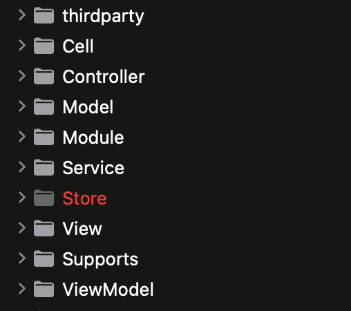
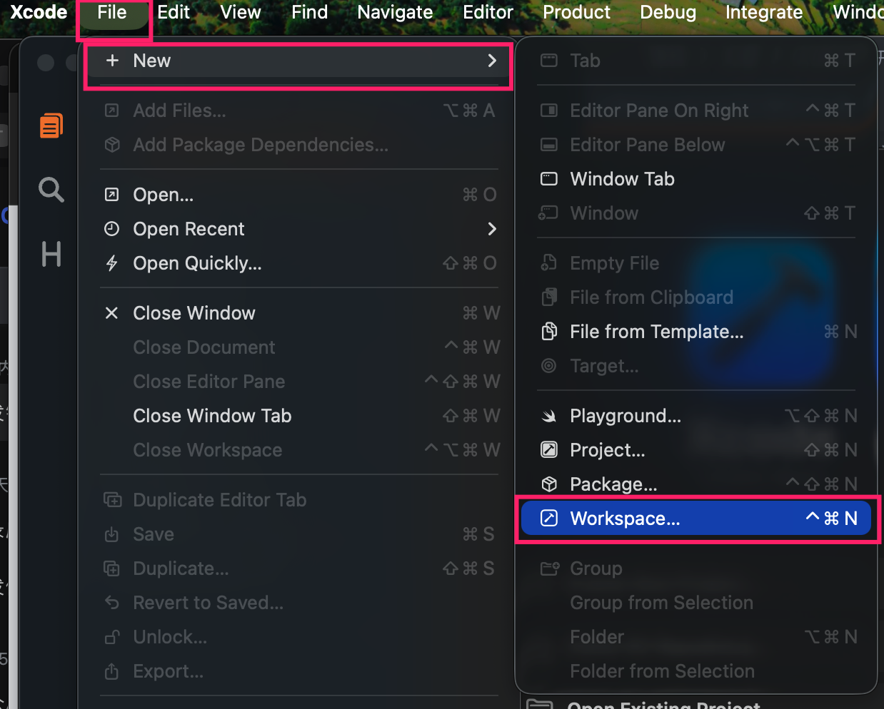
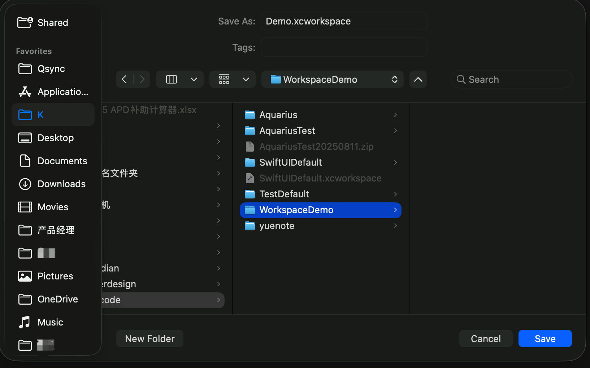
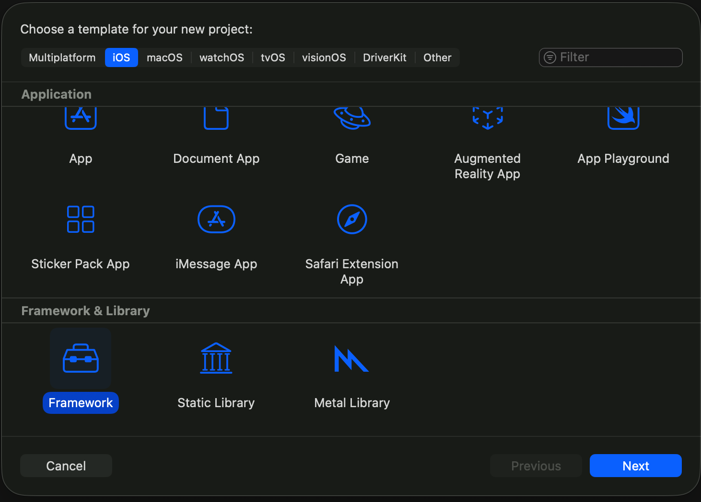
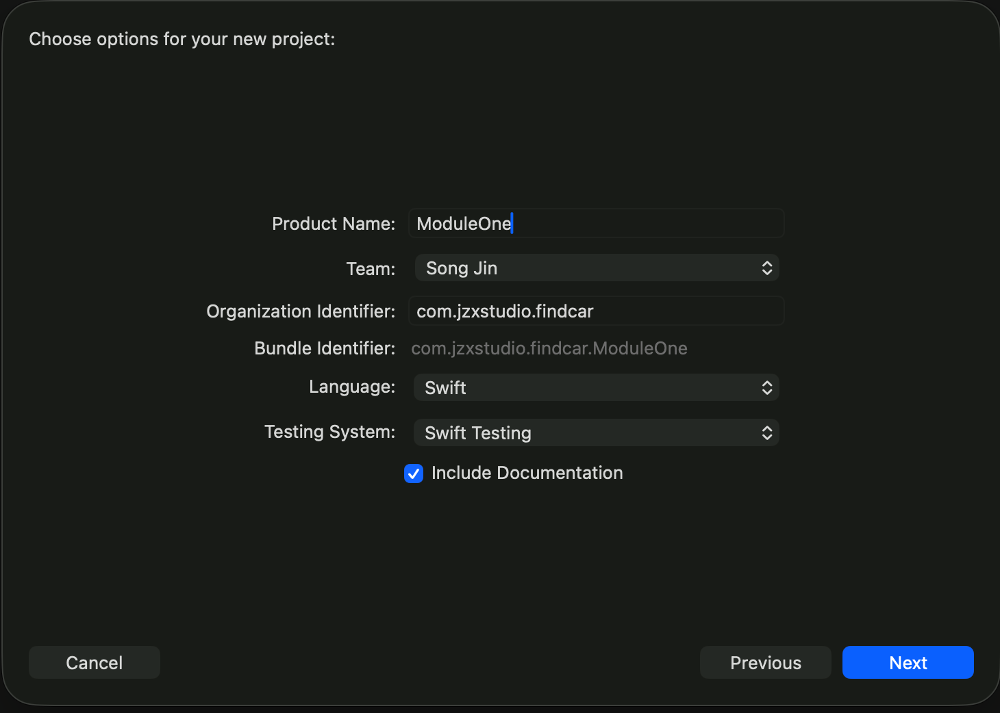
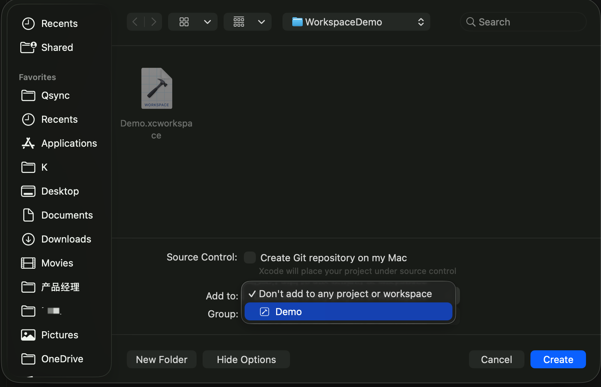
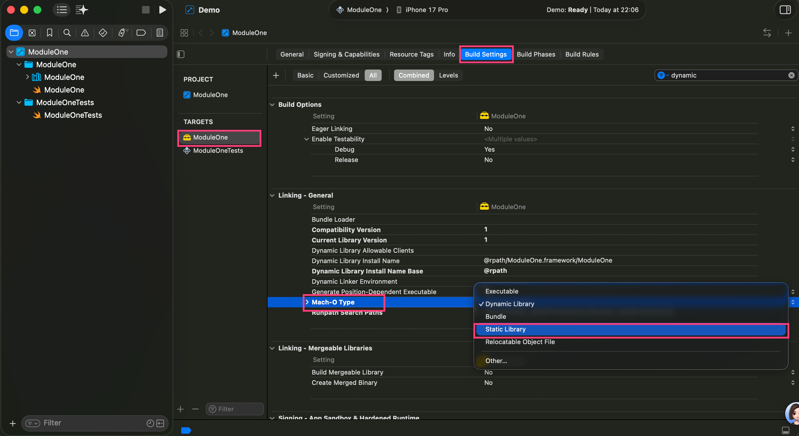

大家好，我是K哥。一名独立开发者，同时也是Swift开发框架【**Aquarius**】的作者，**悦记**和**爱寻车**app的开发者。

**Aquarius**开发框架旨在帮助独立开发者和中小型团队，完成iOS App的快速实现与迭代。使用框架开发将给你带来简单、高效、易维护的编程体验。

---

# 引言

在iOS开发中，面对日益复杂的业务需求和团队协作挑战，如何构建可维护、可扩展的架构？Aquarius框架通过'模块化 + MVVM + 洋葱开发法'的铁三角模式，为独立开发者和中小团队提供了一套完整的解决方案。

# 模块化开发

## 项目工程结构的两种类型

我们在开发时，根据项目的复杂程度，工程结构一般建议采用集成化和模块化两种方式。

**集成化**：所有功能均在主工程中完成

**模块化**：将功能进行拆分、梳理，并将不同功能规划到不同的模块中。主工程由各个模块整合后，形成项目的整体工程结构。

无论是**集成化**开发还是**模块化**开发，本身并没有优劣之分，需要根据实际情况决定。

K哥整理了一个表格来展现两种方式的不同之处：

| 特性       | 集成化开发             | 模块化开发                  |
| -------- | ----------------- | ---------------------- |
| **适用项目** | 功能简单、1-3人小团队、快速迭代 | 功能复杂、多人协作、长期维护         |
| **优点**   | 简单、灵活、开发速度快       | 架构清晰、职责分明、易于复用和测试      |
| **缺点**   | 耦合度高、后期维护成本高      | 前期设计成本高、有一定学习曲线        |
| **工程管理** | 单一工程              | Workspace + 多Framework |

## 不同类型适合哪种项目

一般，功能较少或几人完成的项目建议采用**集成化**开发方式。

当功能较少或1～3人便可完成时，需要的是更加简单、灵活、能够快速推进项目进度的方案，所以**集成化**相对较适合。

当功能较多或需要多人完成时，需要的是**更统一**的项目结构、**更清晰**的功能规划、**更合理**的人员分配。所以**模块化**相对较适合。

## 集成化工程结构

集成化的开发方式相对较简单，但是从工程结构角度看一样需要具备清晰、易懂等要求。

K哥在这里也提出一个工程结构的方案，大家可以参考。如下图所示：



- thirdparty：存放三方源码

- Cell：存放Cell

- Controller：存放Controller

- Model：存放Model

- Module：对外提供的接口

- Service：服务层代码

- Store：存储层代码

- View：存放View

- Supports：存放静态变量。例如：通知ID、绑定ID、三方服务的Key等

- ViewModel：存放ViewModel

当然，这些只是最简单的工程结构。不同公司或者不同的开发者都有自己的工程结构方案。如果你还没有的话，可以参考K哥提供的这个方案。

## 模块化开发

### 模块化概念

模块化不是一个新的概念了，但是在iOS的项目开发中，尤其是在中小型团队和独立开发者中，受到成本、团队协作效率等因素的限制，往往应用较少。

但是，我们知道，每个项目几乎都是按照螺旋曲线不断向上的方式去迭代的。这也就意味着，每个app的功能会随着版本的迭代，不断的增加。

这时，就需要考虑功能迭代、团队协作以及如何释放团队潜力等诸多问题。

模块化正式解决这些问题的不二之选。

### 模块化开发在中大型项目中的意义

首先，模块化在版本迭代过程中起到了平衡各模块的功能布局以及清晰的展现未来产品的发展方向的作用。

其次，模块化可以使多个团队共同维护同一个app有了可实现的方案。不同团队维护自己负责的模块，最后主工程只是起到了整合、发布的作用。

最后，不同团队都有自己不同的目标，彼此也是竞争关系，这就大大的调动了人员的积极性，团队更多的潜力被释放出来，有助于app向着良性的方向发展。

### iOS的项目如何实现模块化开发

那么iOS的项目如何实现模块化呢？

这里K哥提出一个方案，大家可以借鉴。

如果有更好的方式，也可以评论区咱们一起探讨。

1. 通过workspace来管理你的项目

你需要在xcode中建立workspace来管理你的项目。

点击**File-New-Workspace**。如下图所示：



选择保存路径之后，点击**Save**。如下图所示：



2. 创建Framework

点击**保存**之后，Xcode将打开新的窗体。

同样，点击上方的**File-New-Project**

点击**iOS**，在**Framework & Library**分栏中选择**Framework**。如下图所示：



点击**Next**，在弹出的窗体中，输入必要信息。并点击**Next**。如下图所示：



在弹出的窗体中一定要选择你创建的**Workspace**。然后点击**Create**。如下图所示：



3. 选择静态库

创建好**Framework**之后，

**Framework**创建好之后，我们需要点击**TARGETS**，点击**Framework**，在右侧窗口中选择**Build Settings**，找到**Linking - General**，找到**Mach- O Type**，将**Dynamic Library**调整为**Static Library**。如下图所示：



好了，现在你已经创建好了你的第一个模块。

接下来，你可以根据你的实际需求创建多个你自己的模块。

**Xcode**的模块化方案非常的简单。有了模块化之后，当APP的不同模块由不同团队负责。或者你是一名独立开发者，你的APP今后需要交给多个人维护时，不同的团队，或不同的人，只需要拿到他们自己负责的模块源码即可，那么你的项目工程将变得无比整洁与安全。

# MVVM设计模式

**MVVM设计模式**也是一个老话题了。之所以**Aquarius开发框架**采用这种设计模式，是因为框架本身建议大家在开发时更多的使用**ViewModel**来减轻**Controller**层的压力。这对项目开发过程中的多人协作与代码易维护性具有至关重要的作用。

## MVVM解决什么问题

我们知道，大家都习惯将代码写在**Controller**中，随着功能的不断迭代，代码势必会不断增加。也就是说**Controller**层的代码就会越来越多。这对代码的**Review**造成了极大的复杂性。

所以，我们就需要通过**MVVM设计模式**的**ViewModel**来缓解**Controller**的压力。

另外，即使没有**ViewModel**层，我们也应该将**逻辑处理**部分的代码与**Controller**层分离。这样，后期的工程代码才能易于维护。

## Aquarius开发框架对MVVM设计模式的支持

大家都知道，要想实现**MVVM设计模式**，其实是非常简单的，我们只需要创建一个**ViewModel**文件即可。

但是，随着文件的创建，我们势必需要关注**MVVM设计模式**中，各层之间如何来**解耦**的问题。

传统的方式，可以通过**Delegate**实现。

**Aquarius开发框架**提供了更多的解耦方式，你可以通过**通知、数据绑定**等多种方式实现解耦。

**Aquarius开发框架**提供了：

1. **AViewController**，它是**Controller**层的基类

2. **AViewModel**，它是**ViewModel**层的基类

3. **AView**，它是**View**层的基类

**AViewController**，提供了埋点管理、导航条管理、分层管理（洋葱开发法）、主题管理、日志管理、热更新管理。

**AViewModel**，提供了分层管理（洋葱开发法）、Delegate管理、通知管理、数据绑定管理、日志管理、热更新管理。

**AView**，提供了键盘管理、分层管理（洋葱开发法）、Delegate管理、通知管理、数据绑定管理、日志管理、热更新管理。

请不要着急，本篇文章，我们只简单介绍**Aquarius开发框架**各层基类提供的能力，在后续的文章中，我们会逐个介绍各个功能如何使用。

## 如何基于MVVM设计模式开发项目

通过以上的介绍，我们可以了解到，创建一个有效的界面，至少需要包含3个类文件，他们分别是Controller（继承**AViewController**）、View（继承**AView**）和ViewModel（继承**AViewModel**）

代码示例如下：

**TestVM.swift**

```swift
import Aquarius


class TestVM: AViewModel {
    //viewModel层处理逻辑的代码
    public func click() {
        //按钮点击后执行的操作
        ...
    }
    ...
}
```

**TestView.swift**

```swift
import UIKit


import Aquarius


class TestView: AView {
    //初始化UI控件
    private let testLabel: UILabel = A.ui.label
    public let testButton: UIButton = A.ui.button
    ...
    //快速组装UI控件
    override func a_UI() {
        super.a_UI()

        addSubViews(views: [
            testLabel,
            testButton
            ...
        )
    }
    ...
}
```

**TestVC.swift**

```swift
import Aquarius


class TestVC: AViewController {
    private let a_view: TestView = TestView()
    private let viewModel: TestVM = TestVM()

    override func a_UI() {
        super.a_UI()

        addRootView(a_view)
    }

    override func a_Event() {
        super.a_Event()

        a_view.testButton.addTouchUpInsideBlock { [weak self] control in
            //按钮点击事件
            self?.viewModel.click()
            ...
        }
    }
    ...
}
```

这时一个最简单的基于**Aquarius开发框架**实现**MVVM设计模式**的代码结构。

任何复杂的app界面，和处理逻辑，都是基于此扩展出来的。

# 开发铁三角

一个开发项目的成功，需要从**方法 - 架构 - 模式**三个方面来探讨。

先进的方法+稳固的架构+成熟的模式就可以形成开发铁三角。从而才能保证项目内外兼修。

### 构建应用的稳固基石

在复杂的应用开发中，单一的技术或模式往往力有未逮。**Aquarius开发框架**以 **“洋葱开发法”为纲领**，**“模块化”为骨架**，**“MVVM”为神经**的铁三角模型，从宏观到微观，全方位保障代码的质量、可维护性和开发效率。

**1. 宏观纲领：洋葱开发法**

- **定位**：核心**方法论**与**架构哲学**。

- **作用**：它规定了整个应用的代码结构像一颗洋葱，层次清晰。领域模型位于最内层，不受任何外层（如UI、数据库）变化的影响。这是保证应用核心业务逻辑纯粹和稳定的**顶层设计**。

- **类比**：建筑的整体设计蓝图，规定了承重墙、管线走向等根本结构。

**2. 中观骨架：模块化开发**

- **定位**：项目**组织模式**与**工程架构**。

- **作用**：在“洋葱”的每一层中，我们使用模块化将系统拆分为独立的业务模块或功能单元（如“用户模块”、“支付模块”）。每个模块都可以内部采用洋葱分层，并对外暴露清晰的接口。这解决了团队协作、代码复用和部署复杂度的问题。

- **类比**：将大楼划分为不同的功能区域（住宅区、商业区、车库），每个区域可以独立施工和管理。

**3. 微观神经：MVVM设计模式**

- **定位**：前端**交互模式**与**表示层架构**。

- **作用**：在表示层，当我们具体开发一个UI界面时，采用MVVM模式。它负责协调视图的展示、用户的交互和底层数据（可能来自洋葱的领域层）的同步。它完美地解决了视图与业务逻辑的耦合问题。

- **类比**：每个房间内的智能家居系统，它负责接收指令（用户操作）、控制设备（更新视图）并反馈状态（数据绑定），但不管墙壁是如何建造的（模块化）或大楼的地基在哪（洋葱核心）。

### 铁三角的协同工作流

1. **首先，运用MVVM设计模式**进行顶层设计，划分出领域层、应用层、基础设施层和表示层。

2. **接着，运用模块化**将整个系统按功能垂直切割。每个模块都是一个小的“洋葱”，内部包含自己的层次。

3. **最后，在MVVM各层中，运用洋葱开发法**来精细化管理数据流向和用户交互。ViewModel会调用洋葱应用层的服务来获取数据，Model可能就是洋葱领域层的实体或数据传输对象。

### 总结

“以‘模块化’分而治之，用‘MVVM’精雕细琢，所有这一切，都在‘洋葱开发法’规定的秩序下和谐统一。”

---

**立即体验Aquarius：**

**第一步：探索资源**

- **⭐ Star & Fork 框架源码**： [GitHub - JZXStudio/Aquarius](https://github.com/JZXStudio/Aquarius) - 支持项目发展

- **⭐ Star & Fork 框架文档**： [ZRead - JZXStudio/Aquarius](https://zread.ai/JZXStudio/Aquarius) - 项目介绍文档，深入了解框架使用方式

- **⭐ Star & Fork 悦记源码**： [GitHub - JZXStudio/yuenote](https://github.com/JZXStudio/yuenote) - 完整案例，深入了解框架使用方式

**第二步：体验效果**

- **📱 下载示例APP**： [悦记](https://apps.apple.com/cn/app/%E6%82%A6%E8%AE%B0-%E6%84%89%E6%82%A6%E8%AE%B0%E5%BD%95-%E5%BF%AB%E4%B9%90%E7%94%9F%E6%B4%BB/id6739872794) | [爱寻车](https://apps.apple.com/cn/app/%E7%88%B1%E5%AF%BB%E8%BD%A6-%E6%89%BE%E8%BD%A6-%E5%81%9C%E8%BD%A6-%E5%81%A5%E5%BF%98%E7%97%87-%E5%81%9C%E8%BD%A6%E8%B4%B9%E7%94%A8%E6%8F%90%E9%86%92/id6747658196) - 感受真实项目中的流畅体验

**第三步：沟通交流**

- 💬 **提交Issue**：  [GitHub Issues](https://github.com/JZXStudio/Aquarius/issues) - 反馈问题或建议  

- **💌 联系与反馈**： [studio_jzx@163.com](mailto:studio_jzx@163.com) - 直接交流开发心得