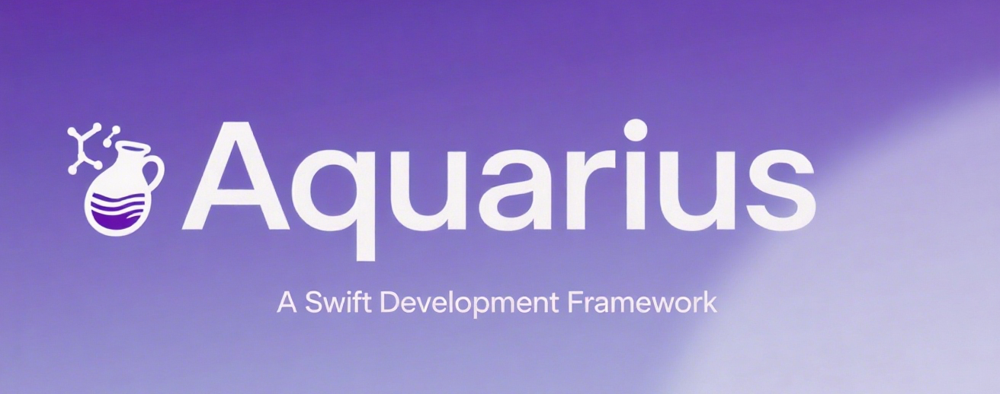

<div align="center">
  
</div>

<div align="center">
    
</div>

# 描述

Aquarius是以帮助开发者规范化开发流程，提高开发效率为目的而设计的Swift开发框架

框架提供低侵入式的framework，既支持新的项目工程，也支持加入到老的工程中

框架本身不依赖任何三方类库，不会增大项目体积

框架以MVVM设计模式为核心，通过一系列定义的方法，提供新的开发方式

框架建议通过方法设置UI组件的属性，基于此原则，重新封装了大部分UI组件的属性

框架提供数据绑定功能，既支持变量间的动态数据更新，也支持变量与UI组件属性的动态数据更新

框架提供：

1. MVVM设计模式

2. 开发方法

3. 数据绑定

4. 大量的创建UI的新方法

5. 深色模式切换

6. 格式转换

7. 通知

8. userDefaults

9. 内购

10. 日历/提醒

11. 位置

12. 依赖注入

13. 日志

14. Timer

15. 格式化属性

# MVVM设计模式

框架提供`AView`、`AViewController`、`AViewModel`，开发中，需基于此三个基类开始开发。例如：

**AView**

主要功能包括：

1. 键盘管理

2. 分层管理

3. 事件管理

4. Delegate管理

5. 通知管理

6. 数据绑定管理

7. 日志管理

8. 热更新管理

**代码示例：**

```swift
import Aquarius


class TestView: AView {

}
```

**AViewController**

主要功能包括：

1. 埋点

2. 导航条管理

3. 分层管理

4. 主题管理

5. 日志管理

6. 热更新管理

**代码示例：**

```swift
import Aquarius


class TestViewController: AViewController {

}
```

**AViewModel**

主要功能包括：

1. 分层管理

2. Delegate管理

3. 通知管理

4. 数据绑定管理

5. 日志管理

6. 热更新管理

```swift
import Aquarius


class TestVM: AViewModel {

}
```

框架提供了代码的低侵入性，可以在老的工程中引入`Aquarius`。引入后，新开发的功能继承`AView`、`AViewController`、`AViewModel`，老功能不受影响。

# 开发方法

`洋葱开发法`是作者为开发方法起的名字，方法主要将开发工作进行细分。

设计了多个方法，开发时只需要覆盖这些方法体，它们会自动执行。

## AViewController

初始化中执行的方法包括：

1. a_Preview：开始前执行

2. a_Begin：开始执行时调用

3. a_Navigation：定制化导航条

4. a_Delegate：设置delegate

5. updateThemeStyle：深色模式切换时调用

6. a_Notification：设置通知

7. a_Bind：设置数据绑定

8. a_Observe：设置Observe

9. a_Event：设置事件

viewDidLoad方法中执行的方法主要包括：

1. a_UI：设置UI组件

2. a_UIConfig：设置UI组件参数

3. a_Layout：设置UI组件的布局

4. a_Other：设置其它内容

5. a_End：代码末尾执行

6. a_Test：测试的代码函数，此函数值在debug模式下执行，发布后不执行

deinit方法中执行的方法包括：

1. a_Clear：销毁时执行

## AView

初始化中执行的方法包括：

1. a_Preview：开始前执行

2. a_Begin：开始执行时调用

3. a_UI：设置UI组件

4. a_UIConfig：设置UI组件参数

5. a_Layout：设置UI组件的布局

6. a_Notification：设置通知

7. a_Delegate：设置delegate

8. updateThemeStyle：深色模式切换时调用

9. a_Bind：设置数据绑定

10. a_Event：设置事件

11. a_Other：设置其它内容

12. a_End：代码末尾执行

13. a_Test：测试的代码函数，此函数值在debug模式下执行，发布后不执行

deinit方法中执行的方法包括：

1. a_Clear：销毁时执行

## AViewModel

初始化中执行的方法包括：

1. a_Preview：开始前执行

2. a_Begin：开始执行时调用

3. a_Notification：设置通知

4. a_Delegate：设置delegate

5. a_Observe：设置Observe

6. a_Other：设置其它内容

7. a_End：代码末尾执行

8. a_Test：测试的代码函数，此函数值在debug模式下执行，发布后不执行

deinit方法中执行的方法包括：

1. a_Clear：销毁时执行

## ATableViewCell

初始化中执行的方法包括：

1. a_Preview：开始前执行

2. a_Begin：开始执行时调用

3. a_UI：设置UI组件

4. a_UIConfig：设置UI组件参数

5. a_Layout：设置UI组件的布局

6. updateThemeStyle：深色模式切换时调用

7. a_Notification：设置通知

8. a_Delegate：设置delegate

9. a_Observe：设置Observe

10. a_Bind：设置数据绑定

11. a_Event：设置事件

12. a_Other：设置其它内容

13. a_End：代码末尾执行

deinit方法中执行的方法包括：

1. a_Clear：销毁时执行